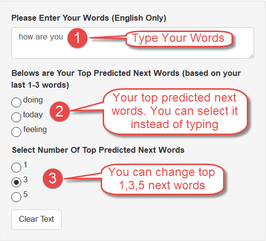
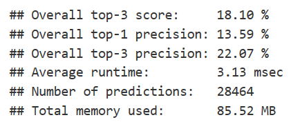

Coursera Data Science Capstone: The Next Word Prediction App
========================================================
author: Eakalak Suthampan
date: 8 June 2017

This capstone is a final project of [Data Science Specialization](https://www.coursera.org/specializations/jhu-data-science)

[My other projects for this course](http://rpubs.com/suteak)

Introduction
========================================================

This is a presentation for the [Coursera Data Science Capstone](https://www.coursera.org/learn/data-science-project). The objective of this capstone is to build a smart typing application that can help typing more easier by predicting the next word based on current words like those used by [SwiftKey](https://swiftkey.com). 

* The shiny app for this capstone
[https://suteak.shinyapps.io/Coursera_Data_Science_Capstone](https://suteak.shinyapps.io/Coursera_Data_Science_Capstone)
* The source code for this capstone
[https://github.com/eakalak-suthampan/Coursera_Data_Science_Capstone](https://github.com/eakalak-suthampan/Coursera_Data_Science_Capstone)
* The Week 2 Milestone Report 
[http://rpubs.com/suteak/275698](http://rpubs.com/suteak/275698)
* This Slide Desk [http://rpubs.com/suteak/283308](http://rpubs.com/suteak/283308) 

My Next Word Prediction App
========================================================

***
For example, when someone types "how are you" then the app will predict top three possible next words like "doing", "today", "feeling" and user can easily select it instead of typing by themself.

The Prediction Model
========================================================

* Traing Data Set are given at [Capstone Dataset](https://d396qusza40orc.cloudfront.net/dsscapstone/dataset/Coursera-SwiftKey.zip) and consist of Twitter, News, Blogs datasets. The total size of the datasets are around 556 MB.
* Clean the data for example lowercase, remove of punctuation, non-ascii character, profanity word.
* [Ngrams](http://en.wikipedia.org/wiki/N-gram) are built using [text2vec](http://text2vec.org/vectorization.html#n-grams) library on 100% of the datasets. 
* 4-gram to 2-gram stupid back-off as a smoothing technique are used to predict the next word based on the previous 1, 2, or 3 words.
* Fast searching on ngram using [data.table and binary search](https://cran.r-project.org/web/packages/data.table/vignettes/datatable-keys-fast-subset.html)
* Drop redundant data on each ngram that have the same search term and frequency below than top 5. 

Summarize Of The Performance
========================================================
The benchmark came from the [discussion forum of the course](https://www.coursera.org/learn/data-science-project/discussions/all/threads/1aWTuoCGEeakbhIiKPxV8w) and can be downloaded from [https://github.com/hfoffani/dsci-benchmark](https://github.com/hfoffani/dsci-benchmark)

I think the top-3 precision score around 22% is acceptable base on the **very fast < 5 msec runtime** and **memory used 86 MB**.

Thank you.

