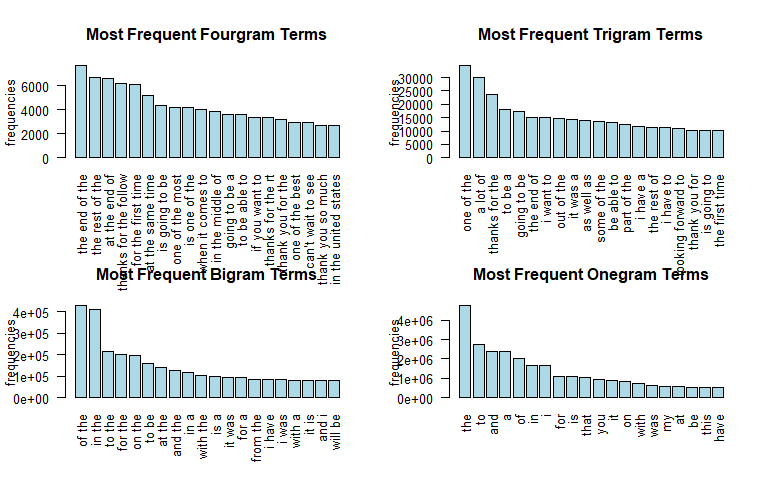

# Coursera Data Science Capstone Project: Milestone Report
Eakalak Suthampan  
May 12, 2017  


#Executive Summary
This Capstone project uses the dataset [Coursera-SwiftKey](https://d396qusza40orc.cloudfront.net/dsscapstone/dataset/Coursera-SwiftKey.zip) to train a model to predict the next word based on the previous 1, 2, or 3 words. 

This is a Milestone Report and the goal of this report is performing exploratory analysis of the dataset to understand the distribution of words and relationship between the words. The [n-gram](https://en.wikipedia.org/wiki/N-gram) will be used to show the relationships between words and their frequencies.

The n-grams are built on the entire datasets (twitter+news+blogs) instead of just a sampling by using the library [text2vec](text2vec.org). The executions time is acceptable if the low frequent terms (frequency < 2) are prune out.

#Loading The Data
The [Coursera-SwiftKey](https://d396qusza40orc.cloudfront.net/dsscapstone/dataset/Coursera-SwiftKey.zip) consists of Twitter, News, Blogs datasets. These datasets will be used to build n-grams.

[profanity words](http://www.bannedwordlist.com/lists/swearWords.txt) will be removed from the datasets in the cleaning process. 


#Basic Summaries Of The Data Sets

Table: Basic Summaries Of The Data Sets

Dataset    Size in MB   Number of Lines   Total Words   Avg. Words Per Line   Max Character in One Line
--------  -----------  ----------------  ------------  --------------------  --------------------------
twitter           159           2360148      30657929                    13                         213
news              196           1010242      34613675                    34                       11384
blog              200            899288      38171210                    42                       40835

#Cleaning The Data
merge the datasets (twitter, news, blogs) then clean the merged dataset. The cleaning are

* to lowercase, remove number

* remove url, email, hashtag

* remove non-ascii character (not english character will be removed)

* remove punctuation except apostrophe and period

* remove profanity words

* strip whitspace

I choose to keep apostrophe (') and period (.) and do not stemming words and do not remove stopwords. So that the ngram terms look more make sense.

```
## Loading required package: NLP
```

```
## cleaning data: execution time is  496.0282 secs
```


#Building Ngram Terms Count
I built n-grams on the entire dataset (twitter+news+blogs) instead of just a sampling. The [text2vec](text2vec.org) library is used to build n-grams (n-gram terms and their count). The execution time is acceptable if the low frequent terms (frequency < 2) are prune out.  text2vec is much faster and less memory consume than the library(tm). I can run the entire data on my laptop 12G Ram, X86_64 Dual Cores CPU.


## Building Fourgram

```
## building fourgram: execution time is  519.0867 secs
```

```
##                    terms count
## 1         the end of the  7690
## 2        the rest of the  6673
## 3          at the end of  6617
## 4     for the first time  5155
## 5  thanks for the follow  4955
## 6         is going to be  4331
## 7        one of the most  4288
## 8          is one of the  4159
## 9       when it comes to  4031
## 10      in the middle of  3865
```


##Building Trigram

```
## building trigram: execution time is  587.9622 secs
```

```
##             terms count
## 1      one of the 34268
## 2        a lot of 29815
## 3  thanks for the 23697
## 4         to be a 18146
## 5     going to be 17217
## 6       i want to 15614
## 7      the end of 14886
## 8      out of the 14717
## 9        it was a 13968
## 10     as well as 13667
```

##Building Bigram

```
## building bigram: execution time is  498.3386 secs
```

```
##       terms  count
## 1    of the 429690
## 2    in the 408558
## 3    to the 213092
## 4   for the 200119
## 5    on the 195492
## 6     to be 158435
## 7    at the 142074
## 8   and the 125032
## 9      in a 119334
## 10 with the 105283
```

##Building Onegram

```
## building onegram: execution time is  114.9235 secs
```

```
##    terms   count
## 1    the 4738525
## 2     to 2742991
## 3    and 2388491
## 4      a 2369021
## 5     of 2000851
## 6     in 1628804
## 7      i 1617374
## 8    for 1092349
## 9     is 1061789
## 10  that 1012478
```

##Terms Count Summary
Ngram terms count summary using the entire data (twitter, news, blogs). Terms count < 2 are prune out for bigram, trigram, fourgram. Onegram does not prune. 

Table: Terms Count Summary

ngram            mean   median   min       max   quantile_25   quantile_50   quantile_75   quantile_99   number_of_terms
---------  ----------  -------  ----  --------  ------------  ------------  ------------  ------------  ----------------
fourgram     6.881601        2     2      7690            81            81            81            81           1087757
trigram     14.115766        2     2     34268           192           192           192           192           1934808
bigram      42.924941        4     2    429690             2             4            12           567           1550020
onegram     87.479362        1     1   4738525           554           554           554           554           1135465

#Exploratory Data Analyses
This section will show relationships between words and their frequency for each ngram.

##Most Frequent Terms Wordclouds
The frequent terms in wordclouds show a lot of stop words. But I think the terms looks more make sense than if removing stop words.

<!-- -->

##Most frequent Terms Bar Plots
The order of the frequencies scale are onegram frequency > bigram frequency > trigram frequency > fourgram frequency.  
<!-- -->

##Terms Count Boxplots
All boxplots show that almost all of the count are at the very begining while outliers have a very long spread far away.
<!-- -->

#Next Steps

* Create ["Markov Chains"](https://sookocheff.com/post/nlp/ngram-modeling-with-markov-chains/) for each ngram. For example in trigram, suppose there are terms

```
##        terms count
## 1 I love you    10
## 2 I love dog     6
## 3 I love cat     4
```
The Markov chains will be

```
##   current_state next_state probability
## 1        I love        you       10/20
## 2        I love        dog        6/20
## 3        I love        cat        4/20
```

* Use probability in Markov Chains with "Smoothing techniques" (techniques to handle when word is unseen in ngram) to predict the top 3-5 possible next words. The interesting techniques are ["backoff" and "interpolation"](http://l2r.cs.uiuc.edu/~danr/Teaching/CS546-09/Lectures/Lec5-Stat-09-ext.pdf). 

* To evaluate the model, I will try [Next word prediction benchmark](https://github.com/hfoffani/dsci-benchmark).

* Use onegram as dictionary to compress data in fourgram, trigram, bigram.

* Things to determine.

    + which smoothing techniques, backoff or interpolation?
    
    + use fourgram or trigram at most?
    
    + min count of word to prune out from ngram?
        

#Appendix
**Loading The Data**

```r
# download data if not exist
if(!file.exists("Coursera-SwiftKey.zip")) {
        download.file("https://d396qusza40orc.cloudfront.net/dsscapstone/dataset/Coursera-SwiftKey.zip","Coursera-SwiftKey.zip")
        unzip("Coursera-SwiftKey.zip")
}
if(!file.exists("swearWords.txt")) {
        download.file("http://www.bannedwordlist.com/lists/swearWords.txt","swearWords.txt")
}

# Read data
file1 <- "final/en_US/en_US.twitter.txt"
file2 <- "final/en_US/en_US.news.txt"
file3 <- "final/en_US/en_US.blogs.txt"
file4 <- "swearWords.txt"       # profanity words that will be removed from the dataset
con <- file(file1)     
twitter.raw <- readLines(con, warn = FALSE)
close(con)
con <- file(file2, open = "rb")
news.raw <- readLines(con, encoding = "UTF-8", skipNul = TRUE, warn = FALSE)
close(con)
con <- file(file3) 
blogs.raw <- readLines(con, warn = FALSE)
close(con)
con <- file(file4)
profanity_words <- readLines(con, warn = FALSE)
close(con)
```
**Basic Summaries Of The Data Sets**

```r
twitter.wordcnt <- sum(sapply(gregexpr("[[:alpha:]]+", twitter.raw), function(x) sum(x > 0)))
news.wordcnt <- sum(sapply(gregexpr("[[:alpha:]]+", news.raw), function(x) sum(x > 0)))
blogs.wordcnt <- sum(sapply(gregexpr("[[:alpha:]]+", blogs.raw), function(x) sum(x > 0)))

twitter.sizeMB <- round(file.info(file1)$size/1024^2)
news.sizeMB <- round(file.info(file2)$size/1024^2)
blogs.sizeMB <- round(file.info(file3)$size/1024^2)

twitter.lines <- length(twitter.raw)
news.lines <- length(news.raw)
blogs.lines <- length(blogs.raw)

twitter.maxchar <- max(nchar(twitter.raw))
news.maxchar <- max(nchar(news.raw))
blogs.maxchar <- max(nchar(blogs.raw))

twitter.wordavg <- round(twitter.wordcnt/twitter.lines)
news.wordavg <- round(news.wordcnt/news.lines)
blogs.wordavg <- round(blogs.wordcnt/blogs.lines)

basic_summary <- data.frame(c("twitter", "news", "blog"), 
           c(twitter.sizeMB ,news.sizeMB, blogs.sizeMB),
           c(twitter.lines,news.lines,blogs.lines),
           c(twitter.wordcnt,news.wordcnt,blogs.wordcnt),
           c(twitter.wordavg, news.wordavg, blogs.wordavg),
           c(twitter.maxchar,news.maxchar,blogs.maxchar))
colnames(basic_summary) <- c("Dataset", "Size in MB", "Number of Lines", "Total Words",
                             "Avg. Words Per Line", "Max Character in One Line" )
library(knitr)
kable(basic_summary, caption = "Basic Summaries Of The Data Sets")
```
**Cleaning The Data**

```r
# merge all data
alldata <- c(twitter.raw,news.raw,blogs.raw)
rm(twitter.raw); rm(news.raw); rm(blogs.raw);

## begin clean data
clean_data <- function(text) {
        library(tm)
        text <- tolower(text)
        text <- removeNumbers(text) 
        text <- gsub("(f|ht)tp(s?)://(.*)[.][a-z]+", " ", text) # remove url
        text <- gsub("\\S+@\\S+", " ", text) # remove email
        text <- gsub("#[a-z0-9]+", " ", text) # remove twitter hashtag
        text <- gsub("@\\w+", " ", text) # remove twitter @username
        # remove non-ascii
        text <- gsub("[a-z]*X+[a-z]*", " ", iconv(text, from="UTF-8", to="ASCII",sub="X"))
        # remove punctuation except apostrophe and period
        text <- gsub("[^('.)[:alnum:] ]","",text) 
        #text <- removePunctuation(text)
        text <- removeWords(text, profanity_words) # remove profanity words
        text <- stripWhitespace(text) #stripe whitespace
        text
}

t1 = Sys.time()
alldata <- clean_data(alldata)
cat("cleaning data: execution time is ", difftime(Sys.time(), t1, units = 'sec'),"secs")
## end clean data
```
**Building Ngram Terms Count**

```r
# ngram terms count function
termsCount <- function(text, ngram=1, count_min=1) {
        library(text2vec)
        it_train = itoken(text, tokenizer=space_tokenizer, progressbar = FALSE)
        vocab <- create_vocabulary(it_train, ngram = c(ngram, ngram), sep_ngram = " ")
        vocab <- vocab %>% prune_vocabulary(term_count_min = count_min)
        data.frame(terms=vocab$vocab$terms, count=vocab$vocab$terms_counts)
}

# split all data to chunks for performance purpose. 100000 rows for each chunk
chunks <- split(alldata, ceiling(seq_along(alldata)/100000))
```
**Building Fourgram**

```r
## begin fourgram, prune count < 2
fourgram <- NULL
i <- 1
t1 = Sys.time()
# process each chunk at a time to avoid memory explode then aggregate the results 
for(chunk in chunks) {
        #cat("  fourgram: processing chunk",i,"of",length(chunks))
        fourgram <- rbind(termsCount(text=chunk, ngram=4, count_min=2), fourgram)
        i <- i+1
}
fourgram <- aggregate(count ~ terms, data=fourgram, sum)
fourgram <- fourgram[order(fourgram$count, decreasing = TRUE) ,]
rownames(fourgram) <- NULL
cat("building fourgram: execution time is ", difftime(Sys.time(), t1, units = 'sec'),"secs")
#write.table(fourgram,"alldata_fourgram.csv",sep = ",")
#read.table("alldata_fourgram.csv", header = TRUE, sep = ",")
head(fourgram,10)
## end fourgram
```
**Building Trigram**

```r
## begin trigram, prune count < 2
trigram <- NULL
i <- 1
t1 = Sys.time()
# process each chunk at a time to avoid memory explode then aggregate the results 
for(chunk in chunks) {
        #cat("  trigram: processing chunk",i,"of",length(chunks))
        trigram <- rbind(termsCount(text=chunk, ngram=3, count_min=2), trigram)
        i <- i+1
}
trigram <- aggregate(count ~ terms, data=trigram, sum)
trigram <- trigram[order(trigram$count, decreasing = TRUE) ,]
rownames(trigram) <- NULL
cat("building trigram: execution time is ", difftime(Sys.time(), t1, units = 'sec'),"secs")
#write.table(trigram,"alldata_trigram.csv",sep = ",")
head(trigram,10)
## end trigram
```
**Building Bigram**

```r
## begin bigram, prune count < 2
bigram <- NULL
i <- 1
t1 = Sys.time()
# process each chunk at a time to avoid memory explode then aggregate the results 
for(chunk in chunks) {
        #cat("  bigram: processing chunk",i,"of",length(chunks))
        bigram <- rbind(termsCount(text=chunk, ngram=2, count_min=2), bigram)
        i <- i+1
}
bigram <- aggregate(count ~ terms, data=bigram, sum)
bigram <- bigram[order(bigram$count, decreasing = TRUE) ,]
rownames(bigram) <- NULL
cat("building bigram: execution time is ", difftime(Sys.time(), t1, units = 'sec'),"secs")
head(bigram,10)
## end bigram
```
**Building Onegram**

```r
## begin onegram, no prune
t1 = Sys.time()
onegram <- termsCount(text=alldata, ngram=1, count_min=1)
onegram <- onegram[order(onegram$count, decreasing = TRUE) ,]
rownames(onegram) <- NULL
cat("building onegram: execution time is ", difftime(Sys.time(), t1, units = 'sec'),"secs")
head(onegram,10)
## end onegram
```
**Terms Count Summary**

```r
ngram_summary <- data.frame(ngram=c("fourgram", "trigram", "bigram", "onegram"), 
           mean=c(mean(fourgram$count), mean(trigram$count), mean(bigram$count), mean(onegram$count)),
           median=c(median(fourgram$count), median(trigram$count), median(bigram$count), median(onegram$count)),
           min=c(min(fourgram$count), min(trigram$count), min(bigram$count), min(onegram$count)),
           max=c(max(fourgram$count), max(trigram$count), max(bigram$count), max(onegram$count)),
           quantile_25=c(quantile(fourgram$count,0.99), quantile(trigram$count,0.99), quantile(bigram$count,0.25), quantile(onegram$count,0.99)),
           quantile_50=c(quantile(fourgram$count,0.99), quantile(trigram$count,0.99), quantile(bigram$count,0.50), quantile(onegram$count,0.99)),
           quantile_75=c(quantile(fourgram$count,0.99), quantile(trigram$count,0.99), quantile(bigram$count,0.75), quantile(onegram$count,0.99)),
           quantile_99=c(quantile(fourgram$count,0.99), quantile(trigram$count,0.99), quantile(bigram$count,0.99), quantile(onegram$count,0.99)),
           number_of_terms=c(length(fourgram$count), length(trigram$count), length(bigram$count), length(onegram$count)))
kable(ngram_summary, caption = "Terms Count Summary")
```
**Most Frequent Terms Wordclouds**

```r
suppressMessages(library(ggplot2))
suppressMessages(library(wordcloud))

par(mfrow=c(2,2))
set.seed(10)
wordcloud(words = fourgram$terms[1:20], freq = fourgram$count[1:20], scale=c(1.5, 0.5), random.order=FALSE, rot.per=0.35, colors=brewer.pal(8, "Dark2"))
text(x=0.5, y=0, "Fourgram")

wordcloud(words = trigram$terms[1:30], freq = trigram$count[1:30], scale=c(2, 0.6), random.order=FALSE, rot.per=0.35, colors=brewer.pal(8, "Dark2"))
text(x=0.5, y=0, "Trigram")

set.seed(13)
wordcloud(words = bigram$terms[1:40], freq = bigram$count[1:40], scale=c(2.8, 0.8), random.order=FALSE, rot.per=0.35, colors=brewer.pal(8, "Dark2"))
text(x=0.5, y=0, "Bigram")

wordcloud(words = onegram$terms[1:60], freq = onegram$count[1:50], scale=c(3.5, 1), random.order=FALSE, rot.per=0.35, colors=brewer.pal(8, "Dark2"))
text(x=0.5, y=0, "Onegram")
```
**Most frequent Terms Bar Plots**

```r
par(mfrow=c(2,2))
barplot(fourgram[1:20,]$count, las = 2, names.arg = fourgram[1:20,]$terms,
        col ="lightblue", main ="Most Frequent Fourgram Terms",
        ylab = "frequencies")
barplot(trigram[1:20,]$count, las = 2, names.arg = trigram[1:20,]$terms,
        col ="lightblue", main ="Most Frequent Trigram Terms",
        ylab = "frequencies")
barplot(bigram[1:20,]$count, las = 2, names.arg = bigram[1:20,]$terms,
        col ="lightblue", main ="Most Frequent Bigram Terms",
        ylab = "frequencies")
barplot(onegram[1:20,]$count, las = 2, names.arg = onegram[1:20,]$terms,
        col ="lightblue", main ="Most Frequent Onegram Terms",
        ylab = "frequencies")
```
**Terms Count Boxplots**

```r
par(mfrow=c(2,2))
boxplot(fourgram$count,horizontal = TRUE, xlab = "Fourgram Count Boxplot")
boxplot(trigram$count,horizontal = TRUE, xlab = "Trigram Count Boxplot")
boxplot(bigram$count,horizontal = TRUE, xlab = "Bigram Count Boxplot")
boxplot(onegram$count,horizontal = TRUE, xlab = "Onegram Count Boxplot")
```


